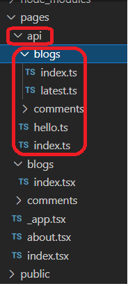

<h2>Motivation</h2>

Play with api routes in next.js by implementing api according to the directory structure

Notice that we implement here  
<ul>
<li>the client :directories public,pages</li>
<li>the server : directories api , data</li>
</ul>

<h2>Tree structure</h2>

pages and api directories are mandatoris. the file names inside api are arbitraries e.g. here hello.ts

The directory structure determine the api route (same idea as for pages) e.g. to access index.ts inside blogs you need to access /api/blogs

<h2>API</h2>
<h3>trivial api</h3>
check api/blogs , api/hello.ts , api/index.ts

<h3>simple api</h3>

check api/comments

implement CRUD .api storage is comments.json under data directory

<h4>Handle comments and comment without id : api/comments/index.ts</h4>
http methods : POST , GET

<h4>Handle comment with id : api/comments/[id].ts</h4>
http methods :  DELETE, GET, PATCH

<h2>trivial handler</h2>
This is hello.ts. this code handle requests to /api/hello. Handler name is arbitrary but must be export as default

vercel is read only file system so on the server you can not : create , edit , delete

<h2>open issues</h2>
<ul>
<li>there are few strange problems related to typescript - search for todo</li>
</ul>

<h2>Limitation</h2>
<ul>
<li>vercel is read only file system so on the server you can not : create , edit , delete</li>
</ul>